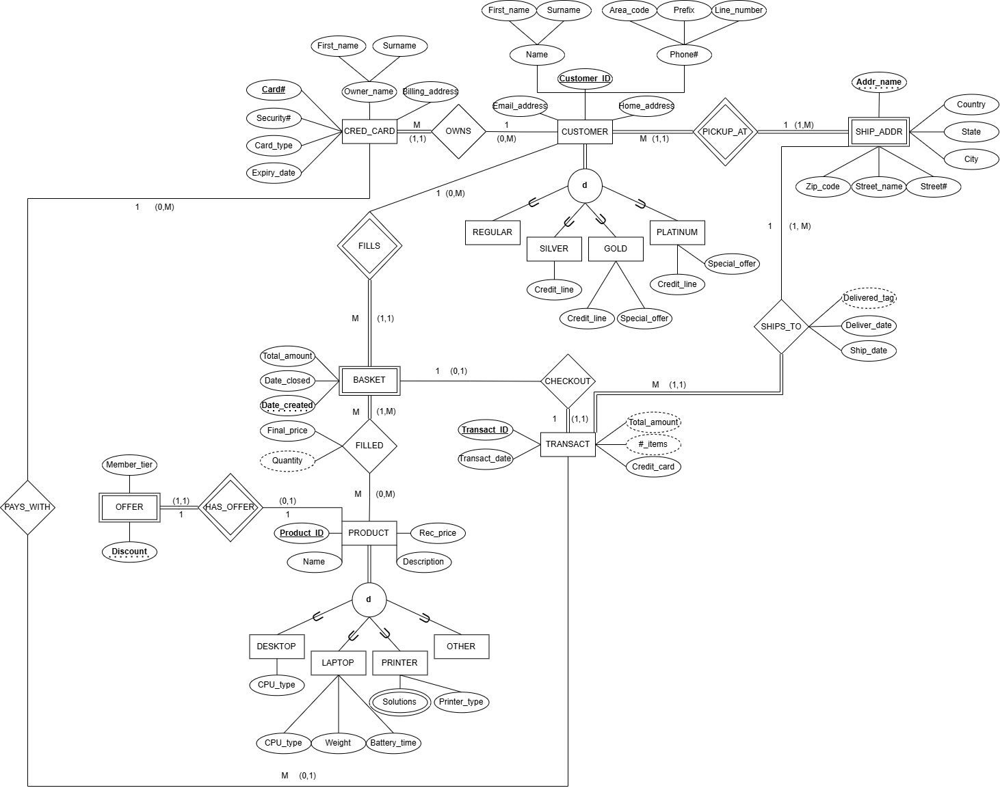

# 🛒 Newark IT Shopping System (MySQL + Python CLI)



A fully functional database-backed shopping system built for the fictional company **Newark IT**, featuring a normalized MySQL database with triggers, sample data, and a Python command-line interface (CLI). This project was created as part of a database systems course and includes components for schema creation, data interaction, and business logic testing.

---

## 📦 Project Structure

```
Database-Project/
├── cli/
│   └── cli.py                          # Python command-line interface for interacting with the database
├── scripts/
│   ├── statistics.sql                  # Sample statistical queries
│   └── testing.sql                     # Scripts to test logic and triggers
├── schema/
│   ├── create_db.sql                   # Schema creation, triggers, and sample data generation
│   ├── eer-diagram.drawio              # EER diagram (editable)
│   ├── eer-diagram-db-project.png      # EER diagram (visual reference)
│   ├── db-project-normalization.xlsx   # Document that was used for normalization process (to 3NF)
│   └── Overview and User Guide.docx    # Project overview and CLI instructions
└── README.md
```


---

## 🗃️ Description of Implementation

The project is composed of two main components:

### 1. **MySQL Database**
The database schema is the core of the application and is built using `create_db.sql`, which runs in three parts:
- **Table Creation**: 14 total tables modeling the shopping process, customers, products, transactions, and more.
- **Trigger Logic**: 7 triggers manage basket and transaction logic for a seamless shopping flow.
- **Sample Data**: Simulated celebrity customer data is inserted for testing and statistics.

**Tables include:**
CUSTOMER_MEMBERSHIP, CUSTOMER, SHIP_ADDR, SHIP_CUST, CRED_CARD, BASKET, PRODUCT_ALL,
FILLED, PRODUCT_LAPTOP, PRODUCT_DESKTOP, PRODUCT_PRINTER, PRINTER_SOLUTIONS, OFFER, TRANSACT


**Trigger Examples:**
- `check_if_user_exists`: Ensures registration before purchase
- `create_basket_after_customer`: Auto-creates basket post-registration
- `set_filled_final_price`: Applies membership discounts
- `update_basket_*`: Syncs basket quantity and total after actions

---

### 2. **Python CLI Interface**

The `cli.py` file provides a simple user interface to interact with the database. It simulates a live shopping experience with options like user registration, order placement, and transaction viewing.

**Main Menu Options:**
- **A**: Register New Customer
- **B**: Add Product to Basket
- **C**: Place Order
- **D**: View Transaction History
- **E**: View Statistics
- **X**: Exit

**Statistics Menu Options (Option E):**
- **A**: Most frequently sold products
- **B**: Products sold to the most unique customers
- **C**: Top 10 customers by spending
- **D**: Top 5 zip codes by shipments
- **E**: Average price per product type
- **X**: Return to main menu

Error handling is built-in—invalid inputs fail gracefully without crashing the app.

---

## 🧪 Additional Scripts

- `statistics.sql`: Contains SQL queries to extract business insights
- `testing.sql`: Tests core logic and trigger functionality for robustness

---

## 🚀 Getting Started

### 🧱 Prerequisites
- MySQL Server
- Python 3.11
- Python package: `mysql-connector-python`

### 🛠 Setup

1. **Clone the Repo**
   ```bash
   git clone https://github.com/RyBres/Database-Project.git
   cd Database-Project
   ```

2. **Create the Database**
    
    Run the create_db.sql script from the schema folder.

3. **Download CLI Requirements**
    
    Ensure you have MySQL connector for Python installed.

4. **Run the CLI**
    
    Run cli.py on the command line or your favorite IDE (I found that Spyder is a good option for this).

---

Issues or Suggestions? Feel free to open an issue or pull request.
